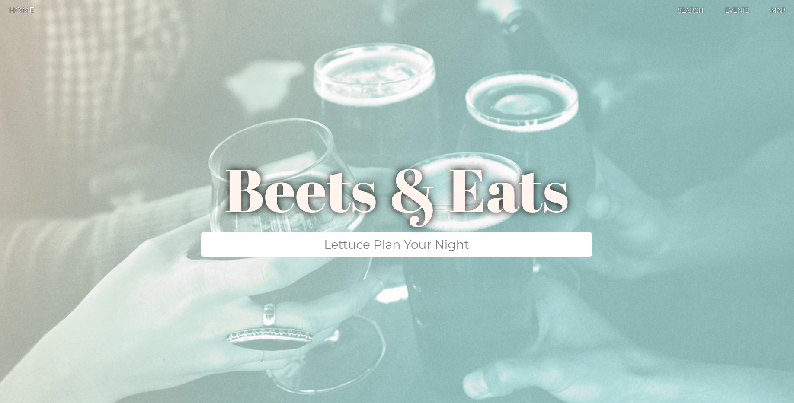
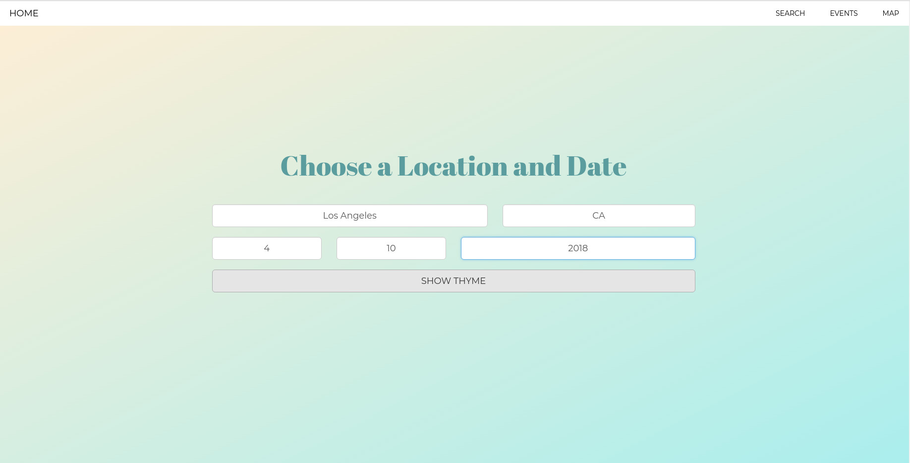
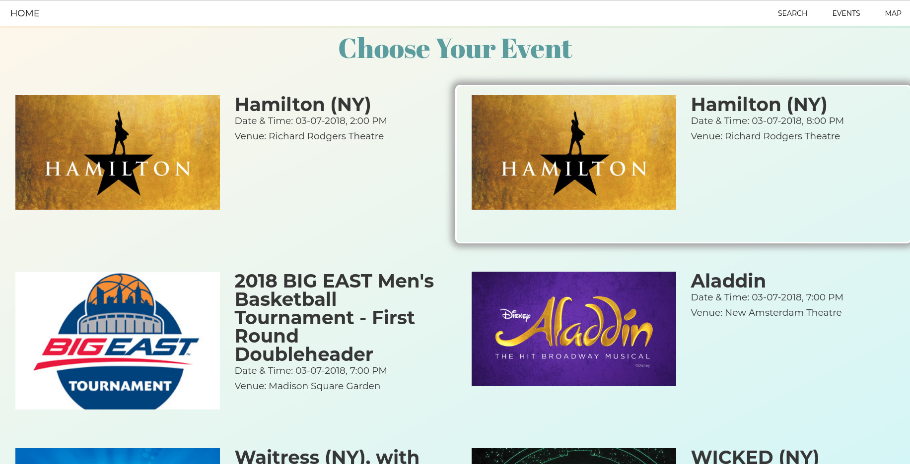
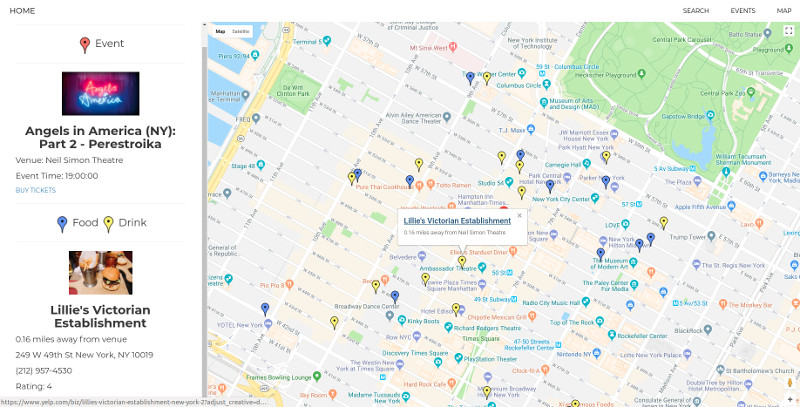

# Beets and Eats

An event planning application to help you plan the drinks and eats near an event of your choice! 

## Getting Started

Begin by entering the location and date of the night you want to plan. Next, scroll through the list of events which you can purchase tickets through Ticketmaster. When you find the event you want, click it and you will be guided to the maps section. The map will be populated with both restaurants and bars located near the event venue. The markers are colored according to their type, drinks or eats. The user can click a marker to see basic information, or look to the sidebar to see a more detailed description. Enjoy your night!

 | 
:-------------------------:|:-------------------------:

 | 
:-------------------------:|:-------------------------:

## Technologies Used

* JavaScript
* jQuery
* AJAX
* HTML5
* CSS3
* Bootstrap3
* Google Maps API
* Yelp API
* Ticketmaster API

## Tools Used

* Git
* GitHub
* MeisterTask
* JSDoc

## Authors

* Andrea Wayte [GitHub](https://github.com/andreasandpiper) | [Portfolio](https://andreawayte.com/)
* Crystal Navarro [GitHub](https://github.com/xoxocrystyle) | [Portfolio](https://crystalnavarro.com/)
* Kelcey Lorenzo [GitHub](https://github.com/m13kelore) | [Portfolio](https://kelceylorenzo.com/)
* Khaleel Younis [GitHub](https://github.com/stallenvp) | [Portfolio](https://khaleelyounis.com/)
* Nick Quan [GitHub](https://github.com/nickkquan) | [Portfolio](https://nickquan.com)

## About the Project

Beets and Eats is the result of a 2 day Hackathon project at Learning Fuze, web development program. The idea spawned from the need to find good restaurants and drinks near a venue location. The goal is for users to easily plan an evening without having to walk far!

